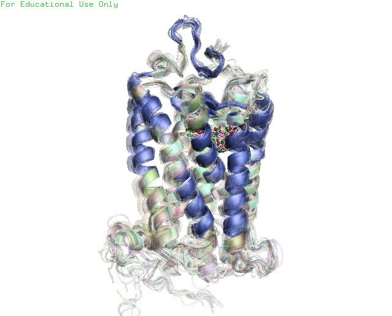

## What's `pymolPy3`?

The package enables the use of PyMOL commands directly in Python 3 scripts.
NO APIs are requierd.  

The length of source code is only 32 lines, but the example has a size of 29MB.  

What can it do?

[](https://youtu.be/BGi00Tl-9L4)


## Install `pymolPy3`

`pip install pymolPy3 --user`

## Basic usage

### Initializ pymol

```Python
import pymolPy3

# Launch pymol with GUI
pm = pymolPy3.pymolPy3()
```

OR

```Python
import pymolPy3

# Launch pymol without GUI
pm = pymolPy3.pymolPy3(0)
```

### Load a PDB structure

```Python
pdb = '1f88'

pm(f"load {pdb}.pdb")
```

### Run PyMOL command in `pm()` -- it's a wrapper

```Python
pm(f"...")
#    ~~~
#     |
#     |_______ A string representing PyMOL command.
```

## Examples

The sample script `align.view.py` under the `examples` directory would produces
the figure below.  


